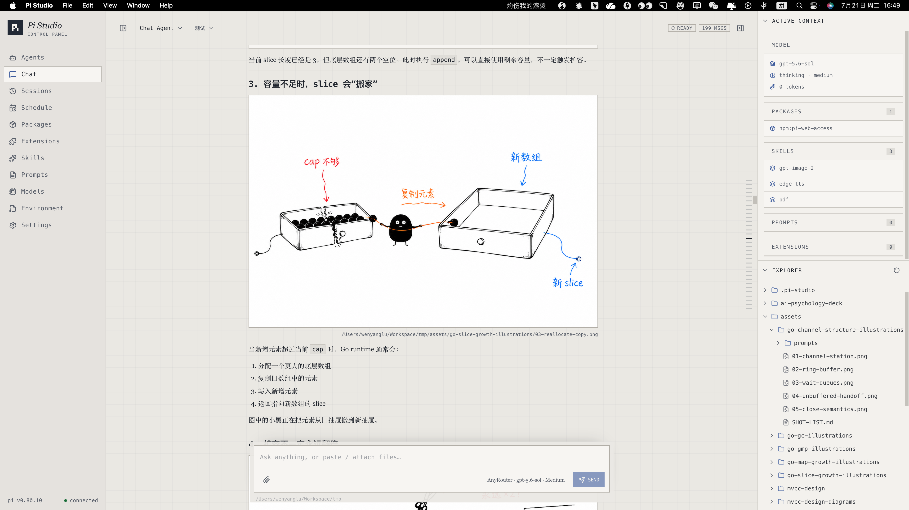

<div align="center">

# Pi Studio

**A local-first web control panel for [Pi](https://pi.dev/) agents.**

Build reusable agent profiles, manage Pi resources, and run persistent, branching coding sessions from one workspace.

[](https://nextjs.org/)
[](https://react.dev/)
[](https://www.typescriptlang.org/)
[](https://www.sqlite.org/)

</div>



## One place for the whole Pi workflow

Pi is a minimal and extensible terminal coding agent. Pi Studio adds a visual workspace around it without replacing its filesystem-based configuration or session model.

- **Agent profiles** — combine a working directory, model range, thinking level, skills, prompts, and MCP configurations into reusable agents.
- **Persistent chat** — stream responses, stop active runs, steer an in-progress task, queue follow-ups, and resume previous sessions.
- **Branch-aware sessions** — inspect the session tree, navigate to an earlier node, create a new branch, or fork work into a separate session.
- **Active context** — see the selected model, token usage, enabled skills, MCP tools, and the agent workspace explorer beside the conversation.
- **Resource control** — manage packages, extensions, skills, prompt templates, MCP servers, model providers, models, and environment files.
- **Local-first storage** — keep application state in SQLite and Pi sessions in JSONL files on your machine.

## Quick start

### Requirements

- Node.js 20.9 or newer
- [pnpm](https://pnpm.io/)
- The [Pi](https://pi.dev/) CLI installed and available as `pi`

### Install

```bash
git clone https://github.com/wylu1037/pi-studio.git
cd pi-studio
pnpm install
pnpm db:migrate
```

Make sure the project root contains the required `.env` configuration before starting the application.

### Development

Run the development server with hot reload:

```bash
pnpm dev
```

Open [http://localhost:3000](http://localhost:3000).

### Production build

Compile and run the optimized production application:

```bash
pnpm build
pnpm start
```

To use a different port:

```bash
pnpm start -- -p 3001
```

Then open [http://localhost:3001](http://localhost:3001).

### Desktop application

Pi Studio can be packaged as an Electron desktop application. The desktop build embeds the Next.js server and stores its database and Pi session files in the operating system application-data directory.

Run the web development server and Electron together in separate terminals:

```bash
pnpm dev
```

```bash
pnpm app:dev
```

Build a native installer for the current operating system:

```bash
pnpm app:build
```

For a faster unpacked test build without creating an installer:

```bash
pnpm app:build:dir
```

The desktop build uses `.electron-staging/` as a disposable packaging workspace.
Next.js builds against the normal Node.js dependencies, while native modules in
the staging copy are rebuilt for Electron. Packaging never rewrites the root
`node_modules` or the original `.next/standalone` output.

Artifacts are written to `dist/`:

- macOS: DMG
- Windows: NSIS installer
- Linux: AppImage

Desktop application data is stored outside the installation directory:

- macOS: `~/Library/Application Support/Pi Studio`
- Windows: `%APPDATA%/Pi Studio`
- Linux: `~/.config/Pi Studio`

After Pi Studio is running:

1. Add a model provider and its available models.
2. Import or create the skills, prompts, packages, and MCP configurations you need.
3. Create an agent profile and select its resources and default working directory.
4. Start a chat session with that agent.

## Workspace areas

| Area                  | Purpose                                                                                    |
| --------------------- | ------------------------------------------------------------------------------------------ |
| Agents                | Create named runtime profiles and assign resources, models, and defaults.                  |
| Chat                  | Work with an agent, inspect process details, branch sessions, and browse the workspace.    |
| Sessions              | Search, resume, duplicate, edit, and remove conversations across agents.                   |
| Packages & Extensions | Manage Pi resource packages and executable extensions.                                     |
| Skills & Prompts      | Build the reusable instruction library available to agent profiles.                        |
| MCP                   | Store MCP server commands, arguments, and environment configuration.                       |
| Models                | Configure providers, discover models, test connections, and choose defaults.               |
| Environment           | Edit selected `.env` files in place without moving their values into the project database. |

## Local data and security

Pi Studio is designed as a local developer tool.

- The default database is `data/pi-studio.sqlite`; override it with `DATABASE_URL`.
- Pi resources use the standard agent directory returned by `getAgentDir()`, normally `~/.pi/agent`.
- Session JSONL files are stored under `data/pi-sessions`.
- Provider credentials and MCP configuration are stored locally. Do not expose a development instance directly to the public internet.
- Environment file contents remain in their original files; Pi Studio stores only the selected paths.

The `data/` directory and local environment files are ignored by Git.

## Technology

- Next.js 16 and React 19
- TypeScript and Tailwind CSS 4
- Hono OpenAPI with generated typed clients
- SQLite, Better SQLite3, and Drizzle ORM
- `@earendil-works/pi-ai`
- `@earendil-works/pi-coding-agent`

## Documentation

- [Development guide](./docs/development.md) — setup, architecture, SDK layers, storage, and common commands.
- [Product requirements](./PRD.md) — product goals, information architecture, and data model.

## Project status

Pi Studio is under active development. Interfaces, database migrations, and Pi SDK integration may continue to evolve before a stable release.
