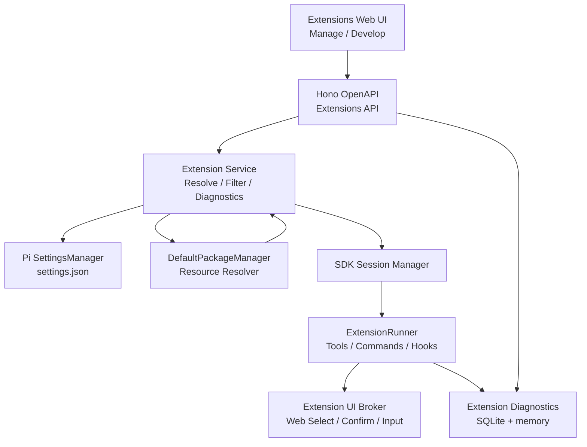
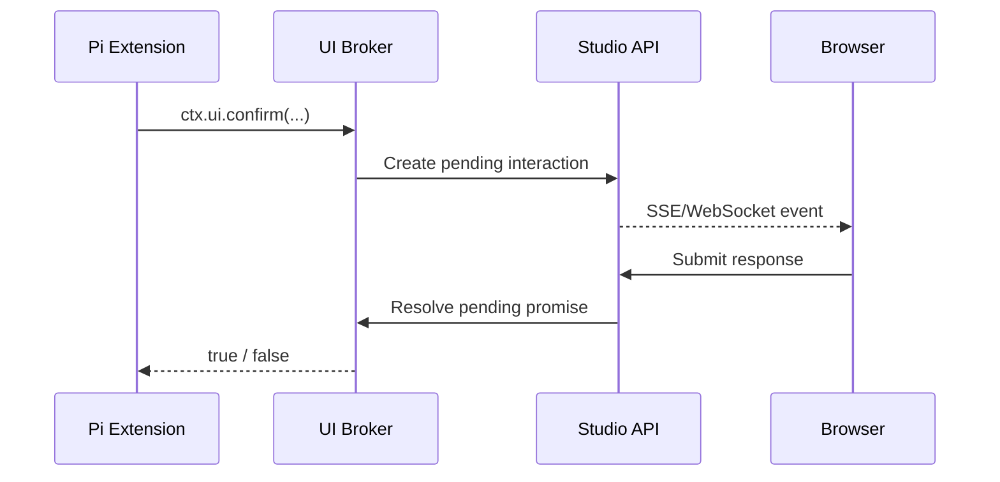

# Extensions 模块功能与技术设计

状态：Proposed

本文档定义 Pi Studio Extensions 模块的产品范围、交互形态、运行时集成和实施边界。它基于当前项目中的 `@earendil-works/pi-coding-agent` 0.80.6 能力，以及 Pi 的 `extensions.md` 和 `packages.md` 文档整理而成。

本文档只描述设计，不代表功能已经全部实现。

## 1. 设计结论

Extensions 页面不应再做一套独立的 Package 安装器。职责边界如下：

| 模块                 | 负责内容                                                                |
| -------------------- | ----------------------------------------------------------------------- |
| Packages             | npm、git、local Package 的安装、更新、删除、Scope 和 Package 级资源过滤 |
| Extensions           | 可执行 Extension 的发现、单项启用、来源、能力、诊断和 Reload            |
| Chat/Session Runtime | Extension 的加载、事件执行、Tool/Command 注册和 Web UI Bridge           |
| SQLite               | 派生的运行快照、错误诊断和审计记录，不作为 Pi 配置事实来源              |

Extensions 页面使用两个 Tab：

```text
Extensions
[ Manage ] [ Develop ]
```

- `Manage`：管理已发现 Extension 的来源、启用状态和运行状态。
- `Develop`：创建、编辑、校验和 Reload 本地 TypeScript Extension。

Pi 的 settings 文件和资源目录是唯一的启用状态来源，通常包括：

- `~/.pi/agent/settings.json`
- `<project>/.pi/settings.json`
- `~/.pi/agent/extensions/`
- `<project>/.pi/extensions/`

## 2. 调研基线

### 2.1 Pi Extension 能力

Pi Extension 是由 jiti 加载的 TypeScript/JavaScript 模块，不要求预先编译。Extension 可以：

- 监听 Project、Session、Agent、Turn、Message、Tool、Provider 等事件。
- 通过 `pi.registerTool()` 注册 LLM 可调用的自定义 Tool。
- 通过 `pi.registerCommand()` 注册 Slash Command。
- 注册 Shortcut、CLI Flag、Message Renderer、Entry Renderer。
- 修改上下文、System Prompt 和 Provider 请求。
- 注册或覆盖 Model Provider。
- 使用 `ctx.ui` 请求 select、confirm、input、notify、status、widget 等交互。
- 使用 `pi.appendEntry()`、Tool Result details 或 Session 生命周期保存状态。

Extension 运行时具有完整的 Node.js 权限，可以执行文件、进程和网络操作。因此它必须被视为可执行代码，而不仅是普通资源文件。

### 2.2 Extension 发现范围

Pi 支持以下来源：

| 来源                                     | Scope          | 说明                               |
| ---------------------------------------- | -------------- | ---------------------------------- |
| `~/.pi/agent/extensions/*.ts`            | global         | 用户级自动发现                     |
| `.pi/extensions/*.ts`                    | project        | 项目级自动发现，需要 Project Trust |
| Package manifest 或 convention directory | global/project | Package 中声明的 Extension         |
| `settings.json` 的 `extensions`          | global/project | 显式配置的本地 Extension 路径      |
| `pi -e` / `--extension`                  | temporary      | 当前运行临时加载                   |

### 2.3 当前实现基线与缺口

当前代码已经具备：

- [Extensions 页面](../components/extensions-view.tsx) 的 Scope 筛选、搜索和开关。
- [Package Service](../lib/packages/package-service.ts) 的 Package 解析、Extension 列表和 Package 级启用逻辑。
- `/api/extensions` 和 `/api/extensions/toggle` API。
- [SDK Session Manager](../lib/chat/sdk-session-manager.ts) 中的 `bindExtensions()`。
- Pi 的 Package Manager、Resource Loader 和 Extension Runner。

当前需要修正的缺口：

1. 当前 toggle 按 `source` 修改 Package 的 `extensions` 配置，实际会禁用一个 Package 中的全部 Extension，而不是单个文件。
2. `GlobalExtension` 只有路径、来源和 enabled 状态，没有版本、能力、运行状态和错误信息。
3. Extension 错误只写入服务端 `console.error`，Web 页面无法查看。
4. 当前 Session 以 `mode: "rpc"` 绑定 Extension，但没有传入 `uiContext`，Pi 会使用 no-op UI；`ctx.ui.select()`、`confirm()` 和 `notify()` 不会进入 Web 页面。
5. 当前 `disposeAllSdkSessions()` 会销毁所有 Session，Extension 配置变化无法按空闲 Session 粒度 Reload。
6. Package Service 创建 SettingsManager 时固定使用 `projectTrusted: true`，需要改为显式 Project Trust 流程。
7. 当前 Session 的 resource signature 主要跟踪 Prompt 路径和 mtime，没有完整覆盖 Extension 文件和 Package 配置。

对应代码入口：

- [components/extensions-view.tsx](../components/extensions-view.tsx)
- [lib/packages/package-service.ts](../lib/packages/package-service.ts)
- [lib/api/app.ts](../lib/api/app.ts)
- [lib/types.ts](../lib/types.ts)
- [lib/chat/sdk-session-manager.ts](../lib/chat/sdk-session-manager.ts)

## 3. 功能设计

### 3.1 页面信息架构

Extensions 页面顶部使用 URL 可持久化的 Tab：

```text
/extensions?tab=manage
/extensions?tab=develop
/extensions?tab=develop&extension=<extension-id>
```

这样可以支持刷新、浏览器前进后退和复制链接。

桌面布局：

```text
┌────────────────────────────────────────────────────────────┐
│ Extensions                         [ Manage ] [ Develop ]  │
├────────────────────────────────────────────────────────────┤
│ Tab content                                                 │
└────────────────────────────────────────────────────────────┘
```

窄屏布局：

- 顶部 Tab 保持不变。
- Develop Tab 内部再使用 `Files / Editor / Inspector` 次级 Tab。
- 不允许编辑器区域造成页面横向滚动。

### 3.2 Manage Tab

#### 顶部工具栏

- Workspace/CWD 选择器。
- Scope：`Effective`、`Global`、`Project`。
- Extension 搜索。
- 状态过滤：`Enabled`、`Disabled`、`Loaded`、`Error`、`Trust required`。
- Capability 过滤：`Tools`、`Commands`、`Hooks`、`Provider`、`UI`。
- Reload 操作。

Project Scope 必须绑定明确的 Workspace/CWD。不能只使用 Pi Studio Web 进程的 `process.cwd()`，因为不同 Agent 可以拥有不同的 `defaultCwd`。

#### 概览指标

建议显示：

- Total Extensions
- Enabled
- Loaded
- Disabled
- Load errors
- Trust required

#### Extension 列表

每一行显示：

- Extension 名称。
- Package 名称和来源。
- Package 版本。
- Global/Project/Temporary Scope。
- Package-managed 或 Local/Auto-discovered 标记。
- 相对路径和可选的绝对路径。
- Enabled/Disabled。
- Loaded/Not loaded/Error/Trust required。
- Capability 标签：Tools、Commands、Hooks、Provider、UI。
- 最近一次加载时间。

#### Extension 详情 Drawer

##### Overview

- Extension 名称。
- 来源 Package。
- Package 版本。
- Scope 和 Origin。
- 相对路径、绝对路径。
- 是否可以单项切换。
- 当前加载它的 Session。

##### Capabilities

- Tools：name、description、参数 schema 摘要。
- Commands：命令名和 description。
- Shortcuts。
- Flags。
- Providers。
- Hooks：注册的事件类型。
- UI：notify、select、confirm、input、widget、custom 等能力。

##### Diagnostics

- Load error。
- Runtime error。
- 错误事件名。
- 错误时间。
- Session ID。
- Stack trace。
- 最近 Reload 结果。

##### Source

- 只读源代码预览。
- 打开本地文件位置。
- 打开 Package 详情。
- 安全警告。

初期不在 Manage Tab 中提供在线编辑和任意执行按钮。

#### Manage 操作

##### 单个 Extension 启用/禁用

操作目标必须是 Extension ID，而不是单纯的 Package source。

对于 Package 内 Extension，Pi 的 Package filters 支持：

- `-relative/path`：排除单个文件。
- `+relative/path`：强制包含单个文件。
- `!pattern`：排除匹配路径。

例如只禁用一个文件：

```json
{
  "source": "npm:acme-pi-tools",
  "extensions": ["-extensions/git.ts"]
}
```

其他 Extension 仍然保持启用。

##### Package 级批量操作

Package 级操作放在 Packages 页面或 Package 详情中：

- Enable all extensions。
- Disable all extensions。
- Reset extension filters。

Extensions 页面不重复实现 Package 安装、删除和更新。

##### Local Extension

显式配置在 `settings.json` 的 Local Extension 可以支持：

- Add path。
- Remove path。
- Open file。
- Enable/disable（通过配置路径存在与否实现）。

自动发现目录中的 Extension 暂时标记为：

```text
Auto-discovered · read-only
```

因为 Pi 原生没有针对自动发现路径的单文件 disable 配置。

##### Reload

提供：

- Reload current session。
- Reload idle sessions。
- Reload all sessions（需要二次确认）。

运行中的 Session 不直接卸载 Extension。UI 应显示：

```text
This change applies to new sessions.
Reload the current idle session to apply it now.
```

### 3.3 Develop Tab

Develop Tab 是本地 TypeScript Extension 开发工作台，而不是通用在线 IDE。

#### 创建 Extension

创建时选择：

- Global 或 Project。
- Extension 名称。
- 目标目录。
- 模板。

第一批模板：

- Empty Extension。
- Custom Tool。
- Slash Command。
- Tool Permission Gate。
- Lifecycle Hook。
- Context/System Prompt Modifier。
- Provider Registration。
- Session State Extension。

默认目录：

```text
.pi/extensions/<extension-name>/
├── index.ts
├── package.json  # 可选
└── README.md     # 可选
```

#### 编辑器区域

桌面端使用三栏：

```text
┌──────────────┬───────────────────────────┬────────────────┐
│ File Tree    │ TypeScript Editor         │ Inspector      │
│              │                           │                │
│ index.ts     │ export default ...        │ Validation     │
│ tools.ts     │                           │ Tools          │
│ package.json │                           │ Commands       │
│              │                           │ Hooks          │
└──────────────┴───────────────────────────┴────────────────┘
```

底部操作：

- Save。
- Validate。
- Save and reload。
- Open test session。

窄屏使用 `Files / Editor / Inspector` 次级 Tab。

#### TypeScript 编辑能力

建议使用 Monaco Editor 或 CodeMirror 6，优先评估 Monaco 的 TypeScript language service 支持。功能包括：

- TypeScript 语法高亮。
- Pi Extension API 类型补全。
- 错误标记。
- 格式化。
- 查找替换。
- 多文件编辑。
- 未保存状态。
- 文件 Tab。

编辑器需要提供 Pi 相关类型声明，包括：

- `ExtensionAPI`
- `ExtensionContext`
- `ExtensionCommandContext`
- `ToolDefinition`
- `ExtensionEvent`
- `ToolCallEvent`
- `SessionManager`

#### 静态校验

保存或 Validate 时执行：

- TypeScript 类型检查。
- 默认导出检查。
- Extension Factory 签名检查。
- import 依赖检查。
- Tool 名称冲突检查。
- Command 名称冲突检查。
- 路径穿越检查。
- `package.json` 依赖格式检查。

静态校验不能执行 Extension Factory，避免用户仅仅点击 Validate 就触发任意代码。

#### Runtime 测试

运行测试必须是显式操作：

1. 保存文件。
2. 创建或选择测试 Session。
3. 显示即将执行的 Extension 路径和安全提示。
4. 用户确认。
5. 在空闲 Session 中 Reload。
6. 展示加载结果、Tools、Commands 和错误。

运行中的 Session 不允许被 Develop Tab 无提示地替换。

#### Develop 与 Manage 的关系

- Develop 保存成功后回到当前 Extension 的详情状态。
- Validate 错误显示在 Develop Inspector，不改变启用状态。
- Save and reload 成功后，Manage Tab 的 runtime snapshot 更新。
- Extension 被删除时只删除 Pi Studio 管理的配置/文件，不删除用户未明确授权的目录。

### 3.4 兼容性标记

每个 Extension 能力需要标记：

```text
Web compatible
Partially compatible
TUI only
```

当前 Pi Studio 运行时：

| 能力                          | 当前可行性   | 说明                                |
| ----------------------------- | ------------ | ----------------------------------- |
| `registerTool()`              | 支持         | 可接入 Agent Runtime                |
| 生命周期 Hooks                | 支持         | 需要错误和状态上报                  |
| Provider 注册                 | 支持         | 需要刷新 Model Registry             |
| Slash Commands                | 部分支持     | 需要接入 Chat 命令发现和执行反馈    |
| `ctx.ui.notify()`             | 待 UI Bridge | 当前没有 Web `uiContext`            |
| `ctx.ui.select()`             | 待 UI Bridge | 需要浏览器 Modal 和 Pending Request |
| `ctx.ui.confirm()`            | 待 UI Bridge | 需要浏览器 Modal 和 Pending Request |
| `ctx.ui.input()`              | 待 UI Bridge | 需要浏览器 Input Dialog             |
| `ctx.ui.custom()`             | TUI only     | 不能直接渲染 Pi TUI Component       |
| 自定义 Message/Entry Renderer | 部分支持     | 需要定义 Web 渲染协议               |

### 3.5 非目标

第一阶段不做：

- 浏览器内任意 Node.js Shell。
- 自动执行第三方 Extension 的“试运行”。
- 完整的在线 Git 客户端。
- Extension Marketplace、评分和发布审核。
- 在 Extensions 页面重复实现 Package 安装器。
- 立即强制卸载运行中的 Extension。
- 将所有 TUI Component 自动转换为 Web React Component。

## 4. 技术设计

### 4.1 系统边界



职责：

- `Extensions Web UI`：展示、编辑、筛选和确认操作。
- `Extensions API`：参数校验、路径权限、Project Trust 和错误返回。
- `Extension Service`：Pi 资源解析、Extension ID、filter merge 和状态转换。
- `SettingsManager`：Pi 配置的事实来源。
- `DefaultPackageManager`：Package 下载、安装、解析、Scope 和资源过滤。
- `ExtensionRunner`：当前 Session 中实际注册的能力和事件执行。
- `Extension UI Broker`：将 Pi `ctx.ui` 转换为 Web 事件。
- `Telemetry`：记录加载、运行、Reload 和 UI Bridge 错误。

### 4.2 事实来源与存储

Extension 的启用状态不能只写入 SQLite。必须写回 Pi Settings，以保证 CLI 和 Pi Studio 互相兼容。

SQLite 可以保存以下派生数据：

- Runtime Extension snapshot。
- Load/runtime diagnostics。
- Reload history。
- UI interaction timeout/error。
- 用户确认记录。

建议不新增单独的 `extensions.enabled` 真值字段，避免 Pi Settings 与 SQLite 不一致。

### 4.3 运行时数据模型

```ts
type ExtensionScope = 'global' | 'project' | 'temporary'
type ExtensionOrigin = 'package' | 'top-level'

type ExtensionStatus =
  'enabled' | 'disabled' | 'loaded' | 'load-error' | 'trust-required' | 'missing'

interface RuntimeExtension {
  id: string
  path: string
  relativePath?: string
  name: string

  source: string
  scope: ExtensionScope
  origin: ExtensionOrigin
  packageManaged: boolean

  enabled: boolean
  status: ExtensionStatus

  package?: {
    source: string
    name?: string
    version?: string
    installedPath?: string
  }

  capabilities: {
    tools: string[]
    commands: string[]
    shortcuts: string[]
    flags: string[]
    providers: string[]
    hooks: string[]
    ui: boolean
  }

  runtime?: {
    loaded: boolean
    sessionIds: string[]
    lastLoadedAt?: string
    lastErrorAt?: string
  }
}
```

错误模型：

```ts
interface ExtensionDiagnostic {
  id: string
  extensionId: string
  sessionId?: string
  event: string
  level: 'error' | 'warning' | 'info'
  message: string
  stack?: string
  createdAt: string
}
```

### 4.4 Extension Resolver

新增服务层接口：

```ts
resolveRuntimeExtensions({
  cwd,
  scope: 'effective' | 'global' | 'project',
})
```

内部使用 Pi 的：

```ts
const resolved = await packageManager.resolve(onMissing)
```

每个 `ResolvedResource` 转换为：

- `path`
- `enabled`
- `metadata.source`
- `metadata.scope`
- `metadata.origin`
- `metadata.baseDir`

Package Extension 的相对路径由 `metadata.baseDir` 计算：

```ts
relative(resource.metadata.baseDir, resource.path)
```

Resolver 必须保留 disabled resources，因为页面需要展示它们及其禁用原因；真正交给 Pi Extension Loader 的路径只允许 `enabled === true` 的资源。

需要处理的优先级：

- Project Package 覆盖 Global Package。
- 同一 canonical path 只显示一个 effective resource。
- 被覆盖的资源可以在详情中标记为 `shadowed`。
- Package 缺失、Project 未信任和路径不存在必须分别返回不同状态。

### 4.5 单个 Extension Toggle

API 不再仅接受 `source`，而应接受稳定的 Extension ID：

```text
POST /api/extensions/:id/state
```

请求：

```json
{
  "enabled": false,
  "cwd": "/workspace/project"
}
```

服务端由 Extension ID 解析：

- Package source。
- Scope。
- Package root。
- Relative path。
- 当前 Package filter。

普通 Package 的处理：

- 禁用：合并精确 `-relative/path`。
- 启用：合并精确 `+relative/path`，或删除等价排除 pattern。

`autoload: false` 的 Package Delta 同样使用 `+/-relative/path`。

已有 filter 不能被覆盖，必须做 pattern merge：

1. 保留其他 resource 类型和已有 pattern。
2. 删除同一文件对应的旧 `+/-/!` pattern。
3. 添加新的精确 pattern。
4. 去重并保持 JSON 可读性。
5. 写入对应 Scope 的 Pi Settings。

### 4.6 API 设计

建议的 API：

| 方法 | 路径                                       | 用途                                 |
| ---- | ------------------------------------------ | ------------------------------------ |
| GET  | `/api/extensions`                          | 列出按 CWD/Scope 解析后的 Extension  |
| GET  | `/api/extensions/:id`                      | 获取 Extension 详情和能力            |
| GET  | `/api/extensions/:id/diagnostics`          | 获取 Extension 错误和 Reload 记录    |
| POST | `/api/extensions/:id/state`                | 启用/禁用单个 Extension              |
| POST | `/api/extensions/reload`                   | Reload 当前或空闲 Session            |
| POST | `/api/extensions/trust`                    | 处理 Project Trust                   |
| GET  | `/api/sessions/:id/extensions`             | 获取当前 Session 的 Runtime snapshot |
| GET  | `/api/sessions/:id/extensions/diagnostics` | 获取当前 Session Extension 错误      |
| GET  | `/api/extensions/:id/source`               | 获取已解析路径的只读源码             |
| POST | `/api/extensions/create`                   | 根据模板创建 Local Extension         |
| PUT  | `/api/extensions/:id/files/content`        | 保存开发 Tab 文件                    |
| POST | `/api/extensions/:id/validate`             | 静态校验，不执行 Extension           |
| POST | `/api/extensions/:id/reload`               | 在目标空闲 Session 中 Reload         |

所有带 CWD 的 API 都必须：

- 解析真实路径。
- 校验 CWD 是否是允许的 Workspace。
- 拒绝路径穿越和符号链接逃逸。
- 对 Project Scope 检查 Trust。

### 4.7 Runtime Snapshot

Pi 的 `AgentSession` 已提供 `extensionRunner`，可以读取：

- `getExtensionPaths()`。
- `getAllRegisteredTools()`。
- `getRegisteredCommands()`。
- `getFlags()`。
- `getShortcuts()`。
- `hasHandlers(eventType)`。
- `onError()`。

建议扩展 `sdk-session-manager`：

```ts
getSdkSessionExtensions(studioSessionId)
getSdkSessionExtensionDiagnostics(studioSessionId)
reloadSdkSessionExtensions(studioSessionId)
```

`RegisteredTool` 和 `RegisteredCommand` 都包含 `sourceInfo`，可据此映射回 Extension ID。

Hook 能力如果需要精确到单个 Extension，建议向 Pi SDK 增加稳定的 `getExtensions()` 或 `getExtensionInfo()` API。不要依赖访问 `ExtensionRunner` 的私有字段。

当前 `onError` 只写服务端日志，应改为写入内存 Ring Buffer 和可选 SQLite：

```ts
onError: (error) => {
  extensionDiagnostics.record({
    sessionId,
    extensionPath: error.extensionPath,
    event: error.event,
    error: error.error,
    stack: error.stack,
  })
}
```

错误返回给浏览器前需要过滤敏感环境变量和过度详细的绝对路径。

### 4.8 Web UI Bridge

Pi 当前没有传入 Web `uiContext`，因此需要为每个 SDK Session 创建 Broker：

```ts
interface ExtensionUiBroker {
  select(sessionId: string, title: string, options: string[]): Promise<string | undefined>
  confirm(sessionId: string, title: string, message: string): Promise<boolean>
  input(sessionId: string, title: string, placeholder?: string): Promise<string | undefined>
  notify(sessionId: string, message: string, type?: 'info' | 'warning' | 'error'): void
  setStatus(sessionId: string, key: string, text?: string): void
  setWidget(sessionId: string, key: string, content?: string[]): void
}
```

交互流程：



规则：

- `notify` 使用现有 Toast 系统。
- `select/confirm/input/editor` 使用统一 Modal。
- 所有 Pending interaction 必须有超时、取消和 Session 关闭处理。
- `setStatus` 写入 Chat Session 状态。
- `setWidget` 显示在 Chat 编辑器上方或侧栏。
- `custom()` 和 TUI Component 初期标记为 TUI-only。
- RPC/JSON/print 模式必须有明确的 capability fallback。

### 4.9 Reload 策略

不要在每次配置变化时无条件调用 `disposeAllSdkSessions()`。

建议：

```ts
reloadSdkSessions({
  cwd,
  sessionIds?: string[],
  mode: 'idle-only' | 'all',
})
```

行为：

- `idle-only`：只 Reload 空闲 Session。
- `all`：运行中的 Session 必须二次确认。
- 运行中的 Session 不强制卸载 Extension。
- 新 Session 自动使用最新配置。
- Reload 失败时保留旧 Session，并返回诊断。

resource signature 应覆盖：

```ts
{
  extensionPaths,
  extensionMtimes,
  packageSettingsHash,
  promptPaths,
  promptMtimes,
}
```

### 4.10 Develop Tab 技术实现

#### 文件访问

文件 API 只允许访问已经解析且被用户选定的 Extension 根目录：

```text
GET  /api/extensions/:id/files
GET  /api/extensions/:id/files/content
PUT  /api/extensions/:id/files/content
POST /api/extensions/create
```

写入前必须检查：

- `realpath` 后仍位于 Extension root。
- 不允许 `..` 穿越。
- 不允许符号链接跳出 root。
- 不允许写入 `.env`、数据库和 Session 目录。
- 使用文件 Mutation Queue 避免并行保存覆盖。

#### 编辑器与类型检查

Pi 运行时用 jiti，不生成构建产物。Develop Tab 仍需要独立 TypeScript 检查：

- 编辑时使用 TypeScript Language Service 增量诊断。
- 保存时执行完整 `noEmit` 检查。
- 引入 Pi Extension 类型声明。
- 不执行 Extension Factory。

#### 依赖安装

Extension 可以带自己的 `package.json`，但安装依赖会执行 npm/pnpm 命令。初期必须显式确认：

- 显示即将执行的命令。
- 显示工作目录。
- 显示依赖变化。
- 允许取消。
- 记录安装日志。

### 4.11 Project Trust

Project Scope 首次访问时应显示：

- 项目路径。
- `.pi` 配置来源。
- 发现的 Project Extensions。
- Package 和 Extension 的安全说明。

操作：

- Trust once。
- Always trust this project。
- Do not trust。

未信任时：

- 不执行 Project Extension。
- 不安装 Project Package。
- 可以显示路径和来源，但状态为 `trust-required`。

Package Service 不能再固定使用 `projectTrusted: true` 作为默认行为。

### 4.12 Agent 级 Extension 策略

Pi 原生 Extension 是 Global/Project 级资源。如果 Pi Studio 希望不同 Agent 使用不同 Extension 集合，可以在后续阶段增加 Agent 级 allowlist。

Pi Resource Loader 支持 `extensionsOverride`，技术方向如下：

```ts
createAgentSessionServices({
  resourceLoaderOptions: {
    extensionsOverride: (base) => ({
      ...base,
      extensions: base.extensions.filter((extension) => selectedExtensionIds.has(extension.path)),
    }),
  },
})
```

对应数据：

```text
agent_extensions
  agentId
  extensionId
```

这不是 MVP，因为它属于 Pi Studio 对 Pi 原生 Scope 的额外隔离策略。

## 5. 实施阶段

### Phase 0：修正基础能力

- 修正 Project Trust，不再默认信任项目。
- 扩展 Runtime Extension 数据结构。
- 将 Package 级 Toggle 改为 Extension 级 Toggle。
- 增加 load/runtime diagnostics。
- 增加 Workspace/CWD 选择。
- 让 Extension 和 Package 的 settings 变化不影响现有 CLI 兼容性。

### Phase 1：Extensions MVP

- Manage/Develop 两个 Tab 壳。
- Effective/Global/Project 列表。
- 单个 Extension 启用/禁用。
- 来源、路径、Package 版本。
- Tools/Commands 能力展示。
- Diagnostics 面板。
- Idle Session Reload。
- 新旧配置生效提示。

### Phase 2：Develop 工作台

- Extension 创建模板。
- 文件树。
- TypeScript 编辑器。
- Validate 和错误标记。
- Save and reload。
- 测试 Session。
- 只读 Source Preview。

### Phase 3：Web UI Bridge

- `notify`、`select`、`confirm`、`input`。
- Chat Status 和 Widget。
- Extension Command 发现和执行反馈。
- Session 级 Runtime snapshot。

### Phase 4：高级能力

- 多文件依赖安装。
- Agent 级 Extension allowlist。
- Extension 性能统计。
- Extension 版本兼容检查。
- Package/Extension 发布和 Marketplace。

## 6. 验收标准

### Manage

- 一个包含三个 Extension 的 Package，可以只禁用其中一个。
- 刷新页面后启用状态仍与 Pi settings 一致。
- Global 和 Project 同名 Package 的优先级正确显示。
- 未信任 Project 时，Project Extension 不执行。
- Load error 可在页面看到 Extension、事件和错误信息。
- 运行中的 Session 不会被无提示销毁。
- 空闲 Session Reload 后使用最新 Extension 配置。

### Develop

- 可以从模板创建 `.pi/extensions/<name>/index.ts`。
- 编辑器能识别 `ExtensionAPI` 和 `Type.Object`。
- 类型错误在保存前可见。
- Validate 不会执行 Extension 代码。
- Save and reload 能看到加载成功或失败结果。
- Extension 文件修改不会越出 Extension root。
- 删除 Local Extension 时不会误删用户目录。

### Runtime/UI Bridge

- `registerTool()` 能在当前 Session 运行。
- Tool/Command 能映射回来源 Extension。
- `ctx.ui.notify()` 能显示在 Chat Toast。
- `ctx.ui.confirm()` 等待浏览器回答，并支持取消和超时。
- Session 关闭后所有 Pending UI interaction 都能结束。

## 7. 参考资料与代码入口

- Pi Extension 文档：`node_modules/@earendil-works/pi-coding-agent/docs/extensions.md`
- Pi Package 文档：`node_modules/@earendil-works/pi-coding-agent/docs/packages.md`
- 当前 Extensions 页面：[components/extensions-view.tsx](../components/extensions-view.tsx)
- Package 解析和开关：[lib/packages/package-service.ts](../lib/packages/package-service.ts)
- Session Runtime：[lib/chat/sdk-session-manager.ts](../lib/chat/sdk-session-manager.ts)
- API 路由：[lib/api/app.ts](../lib/api/app.ts)
- 全局类型：[lib/types.ts](../lib/types.ts)
- 产品需求：[PRD.md](../PRD.md)
